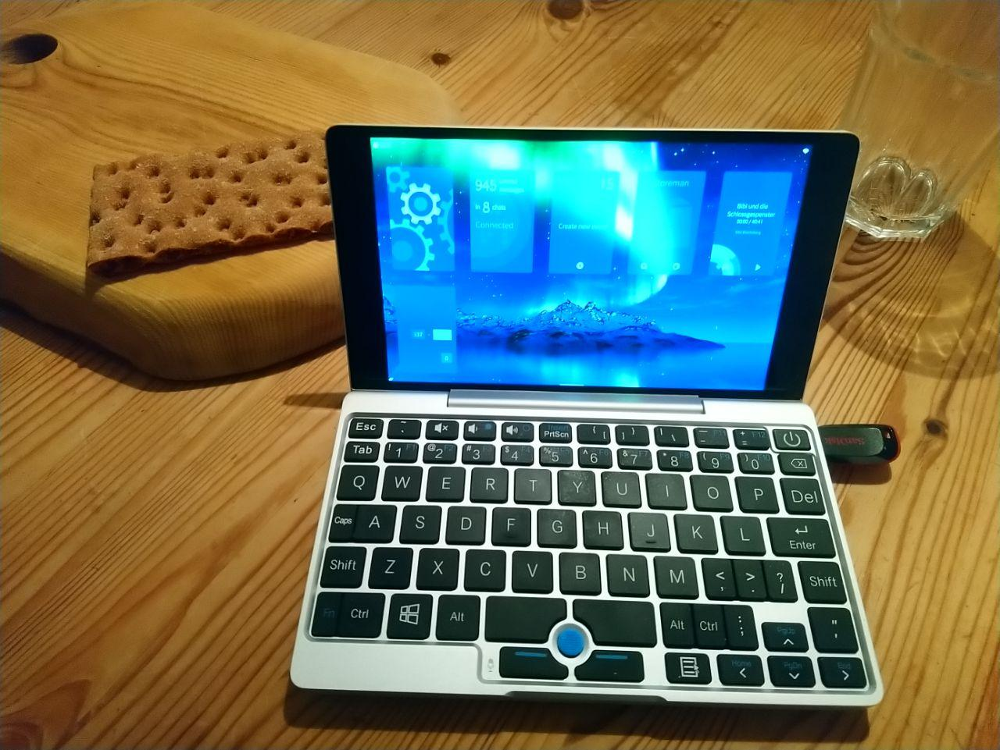
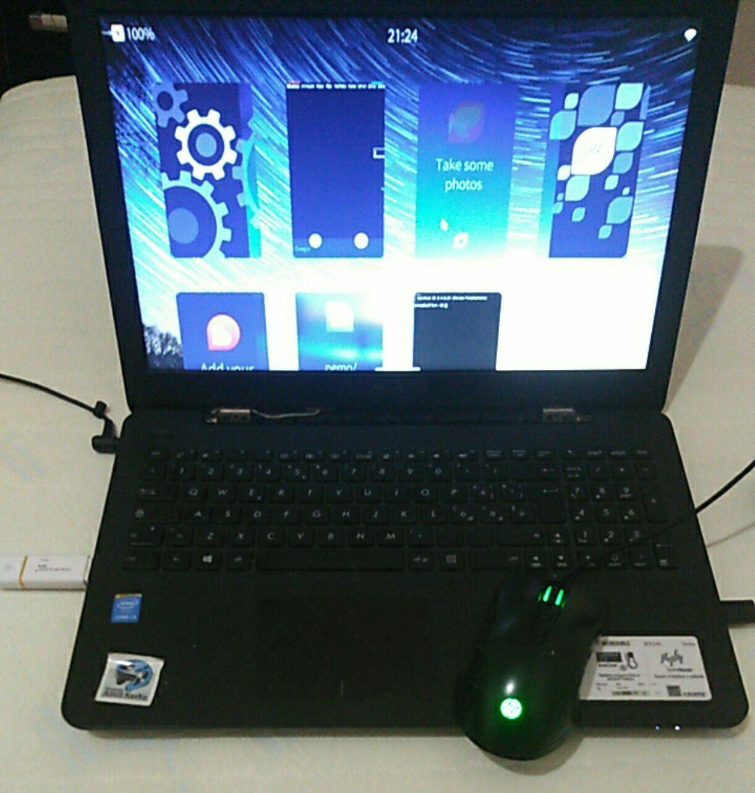

# Welcome!

Sailfish x86 is a port of the Sailfish mobile operating system for laptop and tablet x86_64 based PCs, made by Heng Ye. It is based on Ubuntu 20.04 and Sailfish 3.4. 

It should run on most devices that can boot Ubuntu 20.04 LTS. The current devices that are being used for testing are:

  * Dell XPS 15 2-in-1 (9575)
  * Thinkpad X200T
  * Thinkpad X230T (community: ExPLIT)
  * Asus Transformer Mini T103H
  * Dell Latitude E7450 (community: duvi)
  * GPD Pocket (community: jgibbon)
  * Asus X554L (community: Diego)
  
As of version v0.1, installation is rather difficult. It consists of unpacking a tarball onto a disk and installing GRUB to it. Soon I will make an ISO file to load onto your disk without messing with bootloaders.

## Documentation

Please see https://docs.sailfish-x86.yeheng.org for documentation on Sailfish-x86.

## Status

Most things work, but battery loses charge slightly faster due to the absence of correct suspend. However, if correct suspend is implemented, it will break double tap to wake and notifications. 

## Pictures and Videos

Featured on the Sailfish OS Podcast!

<iframe width="560" height="315" src="https://www.youtube.com/embed/k6io9J2bPDQ" frameborder="0" allow="accelerometer; autoplay; clipboard-write; encrypted-media; gyroscope; picture-in-picture" allowfullscreen></iframe>

Sailfish x86 on Dell XPS 15 2-in-1 (9575) <a href="https://nitter.net/hengyedev/status/1341374202637643777">Video</a>

Thinkpad X200T 

GPD Pocket (Picture by @jgibbon)

 

Asus X554L (Picture by Diego)

## Credits

Note: Sailfish x86 does not have any affiliation with Jolla Ltd. 

Credits:
  * TheKit
  * Adam Pigg
  * ExPLIT
  * Elros34

  
  
  

